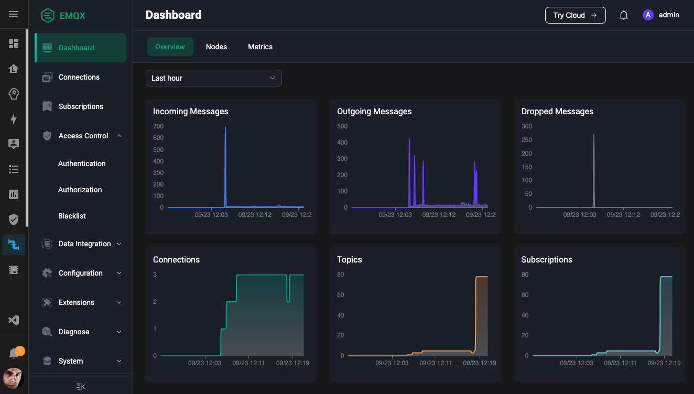

# Home Assistant Community App: EMQX

[![GitHub Release][releases-shield]][releases]
![Project Stage][project-stage-shield]
[![License][license-shield]](LICENSE.md)

[![Github Actions][github-actions-shield]][github-actions]
![Project Maintenance][maintenance-shield]
[![GitHub Activity][commits-shield]][commits]

[![Sponsor Frenck via GitHub Sponsors][github-sponsors-shield]][github-sponsors]

[![Support Frenck on Patreon][patreon-shield]][patreon]

The most scalable MQTT broker for IoT, IIoT, and connected vehicles.

## About

[EMQX][emqx] is an MQTT broker with a high-performance real-time message
processing engine, powering event streaming for IoT devices at massive scale.
As the most scalable MQTT broker, EMQX can help you connect any device, at any
scale (including your home).

The [EMQX MQTT broker][emqx] is an advanced alternative to the Mosquitto MQTT
broker/app that is generally used in Home Assistant. It has a UI
to configure, manage, and debug your MQTT broker, clients, and traffic.

While EMQX sells their product mainly as a cloud hosted product on their
website, this app runs EMQX in a fully local, self-hosted environment.

As of version 5.9.0, EMQX is no longer open source; it is licensed under the
[Business Source License 1.1][emqx-license]. The build shipped here carries the
EMQX Community License, which is free of charge, does not expire, and covers a
single node with up to 10 million concurrent sessions. Clustering is the part
that needs a commercial license, and this app has never clustered.

[:books: Read the full app documentation][docs]

## Support

Got questions?

You have several options to get them answered:

- The [Home Assistant Community Apps Discord chat server][discord] for app
  support and feature requests.
- The [Home Assistant Discord chat server][discord-ha] for general Home
  Assistant discussions and questions.
- The Home Assistant [Community Forum][forum].
- Join the [Reddit subreddit][reddit] in [/r/homeassistant][reddit]

You could also [open an issue here][issue] on GitHub.

## Contributing

This is an active open-source project. We are always open to people who want to
use the code or contribute to it.

We have set up a separate document containing our
[contribution guidelines](.github/CONTRIBUTING.md).

Thank you for being involved! :heart_eyes:

## Authors & contributors

The original setup of this repository is by [Franck Nijhof][frenck].

For a full list of all authors and contributors,
check [the contributors' page][contributors].

## We have got some Home Assistant apps for you

Want more functionality for your Home Assistant instance?

We have created multiple apps for Home Assistant. For a full list, check out
our [GitHub Repository][repository].

## License

MIT License

Copyright (c) 2023-2026 Franck Nijhof

Permission is hereby granted, free of charge, to any person obtaining a copy
of this software and associated documentation files (the "Software"), to deal
in the Software without restriction, including without limitation the rights
to use, copy, modify, merge, publish, distribute, sublicense, and/or sell
copies of the Software, and to permit persons to whom the Software is
furnished to do so, subject to the following conditions:

The above copyright notice and this permission notice shall be included in all
copies or substantial portions of the Software.

THE SOFTWARE IS PROVIDED "AS IS", WITHOUT WARRANTY OF ANY KIND, EXPRESS OR
IMPLIED, INCLUDING BUT NOT LIMITED TO THE WARRANTIES OF MERCHANTABILITY,
FITNESS FOR A PARTICULAR PURPOSE AND NONINFRINGEMENT. IN NO EVENT SHALL THE
AUTHORS OR COPYRIGHT HOLDERS BE LIABLE FOR ANY CLAIM, DAMAGES OR OTHER
LIABILITY, WHETHER IN AN ACTION OF CONTRACT, TORT OR OTHERWISE, ARISING FROM,
OUT OF OR IN CONNECTION WITH THE SOFTWARE OR THE USE OR OTHER DEALINGS IN THE
SOFTWARE.

[commits-shield]: https://img.shields.io/github/commit-activity/y/hassio-addons/app-emqx.svg
[commits]: https://github.com/hassio-addons/app-emqx/commits/main
[contributors]: https://github.com/hassio-addons/app-emqx/graphs/contributors
[discord-ha]: https://discord.gg/c5DvZ4e
[discord]: https://discord.me/hassioaddons
[docs]: https://github.com/hassio-addons/app-emqx/blob/main/emqx/DOCS.md
[emqx-license]: https://github.com/emqx/emqx/blob/main/LICENSE
[emqx]: https://www.emqx.io/
[forum]: https://community.home-assistant.io/?u=frenck
[frenck]: https://github.com/frenck
[github-actions-shield]: https://github.com/hassio-addons/app-emqx/workflows/CI/badge.svg
[github-actions]: https://github.com/hassio-addons/app-emqx/actions
[github-sponsors-shield]: https://frenck.dev/wp-content/uploads/2019/12/github_sponsor.png
[github-sponsors]: https://github.com/sponsors/frenck
[issue]: https://github.com/hassio-addons/app-emqx/issues
[license-shield]: https://img.shields.io/github/license/hassio-addons/app-emqx.svg
[maintenance-shield]: https://img.shields.io/maintenance/yes/2026.svg
[patreon-shield]: https://frenck.dev/wp-content/uploads/2019/12/patreon.png
[patreon]: https://www.patreon.com/frenck
[project-stage-shield]: https://img.shields.io/badge/project%20stage-experimental-yellow.svg
[reddit]: https://reddit.com/r/homeassistant
[releases-shield]: https://img.shields.io/github/release/hassio-addons/app-emqx.svg
[releases]: https://github.com/hassio-addons/app-emqx/releases
[repository]: https://github.com/hassio-addons/repository
